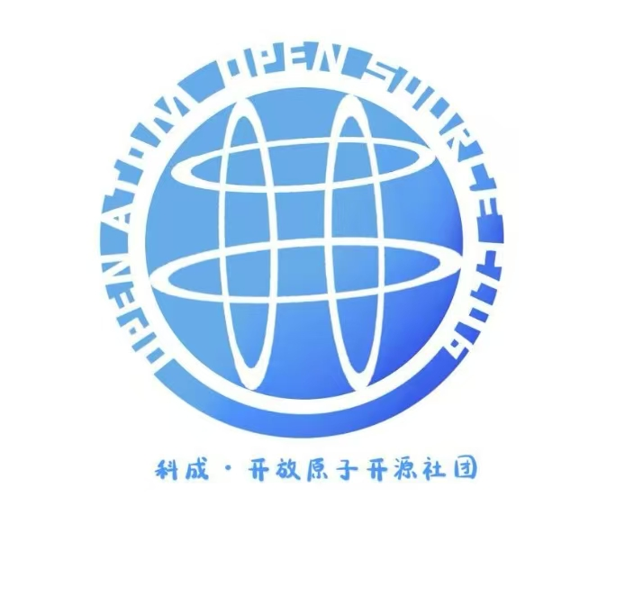

  

  
  
  

<h1 align="center">电子科技大学成都学院开放原子开源社团</h1>

  <strong>因开放而精彩，因开源而未来。</strong>

  连接校园与开源社区，推动开源文化传播、开源项目实践与开源人才培养。

  <a href="#社团介绍">社团介绍</a> ·
  <a href="#开源方向">开源方向</a> ·
  <a href="#成长成果">成长成果</a> ·
  <a href="#活动足迹">活动足迹</a> ·
  <a href="#加入我们">加入我们</a>

---

## 开源方向

> 我们目前仍在成长，因此这里不单纯展示“成熟项目”，也展示社团正在持续投入的开源方向、共建实践和新人参与入口。

<table>
<tr>
<td width="50%" valign="top">

### OpenTenBase 社区共建

围绕国产开源数据库 OpenTenBase，社团持续参与社区学习、实践文章撰写、竞赛训练、城市行协办与高校社区建设。

- 社团协助运营 OpenTenBase 运营专区
- 参与 OpenTenBase 核心贡献挑战赛
- 参与 OpenTenBase 城市行·成都站
- 参与 OpenTenBase 社区年会与分论坛分享

  

</td>
<td width="50%" valign="top">

### OpenHarmony 学习实践

围绕开源鸿蒙方向，社团组织成员参加训练营、竞赛和交流活动，推动同学们从学习者走向实践者。

- 参加开源鸿蒙竞赛训练营
- 两支队伍斩获“潜力无限奖”
- 参与 OpenHarmony 方向学习与任务实践
- 开展开放原子校源行 Meetup 专场活动

  

</td>
</tr>
<tr>
<td width="50%" valign="top">

### 校园开源活动

我们通过讲座、训练营、校源行、社团文化节、1024 程序员节等活动，让更多同学理解开源、接触开源、参与开源。

- 开放原子校源行（电子科技大学成都学院站）
- DataWhale AI+X 高校行
- GitCode G-Star 开源校园行
- 华为软件生态大会与 1024 程序员节

  

</td>
<td width="50%" valign="top">

### 项目与资料沉淀

我们也在逐步沉淀社团自己的系统、资料、博客与项目仓库，让活动成果、学习路线和技术实践能够持续积累。

- 社团官网与活动内容归档
- 战略任务管理系统
- 开源入门资料与活动资料整理
- 技术文章、实践案例与赛事经验沉淀

  

</td>
</tr>
</table>

---

## 社团介绍

电子科技大学成都学院开放原子开源社团，以计算机技术、软件开发与开源实践为主要方向，致力于在校园中传播开源文化、组织开源活动、参与开源项目、培养开源人才。

社团在指导老师魏雨东老师的带领下，围绕 OpenTenBase、OpenHarmony、openEuler、openKylin、GitCode、华为云、腾讯云等方向开展学习、交流、竞赛与项目实践，逐步形成“活动引导、项目牵引、赛事促进、社区共建”的社团发展路径。

---

## 部门建设

| 部门 | 主要职责 |
|---|---|
| 外联部 | 对接高校社团、企业社区、开源组织与校外资源 |
| 宣策部 | 负责公众号、官网、推文、海报、活动宣传与视觉内容 |
| 项目部 | 组织技术学习、项目开发、开源贡献、竞赛训练与实践任务 |
| 组织部 | 负责活动策划、招新安排、现场执行与成员协调 |
| 秘书处 | 负责资料归档、会议记录、文件整理、报销协助等工作 |

---

## 成长成果

<table>
<tr>
<td width="25%" align="center">
  <h3>186 人</h3>
  
社团成员

</td>
<td width="25%" align="center">
  <h3>50 人</h3>
  
通过 OpenTenBase 人才认证

</td>
<td width="25%" align="center">
  <h3>5 人</h3>
  
通过 OpenHarmony 人才认证

</td>
<td width="25%" align="center">
  <h3>多项</h3>
  
开源赛事与社团荣誉

</td>
</tr>
</table>

### 代表性成果

- 社团荣获 2024-2025 学年“优秀社团”称号。
- 荣获 2024 年开放原子校源行“春耕计划”活动“优秀组织高校”。
- 两支队伍在开源鸿蒙竞赛训练营中斩获“潜力无限奖”。
- 多支队伍在第三届开放原子大赛 OpenTenBase 相关赛项中获得三等奖、优秀奖等成果。
- 社团成员获得“开放原子校源行开源大使”“OpenTenBase 校园大使”等称号。
- 社团参与 OpenTenBase 实践文章撰写、社区活动协办、城市行服务与社区年会分享。
- 指导老师与学生代表受邀参加开放原子开发者大会、开放原子校源行、开放原子开源生态大会等活动。

---

## 活动足迹

| 时间 | 活动 | 简介 |
|---|---|---|
| 2024.12 | 2024 开放原子开发者大会暨首届开源技术学术大会 | 社团骨干受邀参会，拓宽开源技术视野 |
| 2024.12 | 访问腾讯云科技（武汉）有限责任公司 | 围绕开源合作、人才培养与企业技术实践进行交流 |
| 2025.03 | 社团文化节 | 面向校内师生展示社团开源成果与荣誉 |
| 2025.04 | 开放原子“校源行”（清华站） | 受邀参会，学习高校开源教育与开源人才评价机制 |
| 2025.04 | DataWhale AI+X 高校行 | 围绕大模型与人工智能应用开展专题分享 |
| 2025.04 | GitCode G-Star 开源校园行 | 参与 Git、GitCode、数据库开发与智能化应用交流 |
| 2025.05 | 开放原子校源行（电子科技大学成都学院站） | 社团作为活动发起方，组织 200 人规模开源讲座 |
| 2025.07 | 开放原子开源生态大会 OpenTenBase 分论坛 | 师生代表受邀分享高校开源社团建设与竞赛实践 |
| 2025.10 | 开放原子开源社团迎新大会 | 面向新成员介绍社团方向、任务分组与开源路径 |
| 2025.10 | 1024 程序员节 | 协助组织鸿蒙生态、华为人才生态训练营等主题活动 |
| 2025.11 | 开源育人新范式分论坛 | 参与高校开源教育、人才培养与社区建设交流 |

---

## 项目与仓库

| 名称 | 简介 | 地址 |
|---|---|---|
| 社团官网 | 社团介绍、活动记录、内容归档与展示窗口 | [查看](https://opensouce-club.top/) |
| 组织仓库 | 社团 GitHub 组织主页 | [查看](https://github.com/CDUESTC-OpenAtom-Club) |
| OpenTenBase 运营专区 | 社团协助参与的 OpenTenBase 社区运营与展示专区 | [查看](https://opentenbase.atomgit.com/) |
| OpenTenBase 核心贡献挑战赛 | 社团队伍参与 OpenTenBase 核心贡献挑战赛并获得成果 | [查看](https://atomgit.com/opentenbase-kernel/000036-node_modules) |
| OpenHarmony 竞赛训练营 | 社团成员参与开源鸿蒙训练营与固定赛道挑战 | [查看](https://gitee.com/honkai_yan/openharmony-competetion) |
| OpenTenBase-Time-Series-Adapter | 社团成员发起的 OpenTenBase 相关开源项目 | [查看](https://github.com/iamkuangzhang/OpenTenBase-Time-Series-Adapter) |

---

## 公众号

  

  关注公众号，获取社团活动通知、技术分享、招新信息与开源实践记录。

---

## 加入我们

如果你对开源、技术、社区协作、项目实践或活动组织感兴趣，欢迎加入电子科技大学成都学院开放原子开源社团。

你可以在这里：

- 学习 Git、Linux、数据库、鸿蒙、人工智能等技术基础；
- 参与 OpenTenBase、OpenHarmony 等开源方向的学习和实践；
- 参加开源讲座、技术训练营、企业参访、校源行和竞赛活动；
- 从文档、测试、实践文章、小任务开始完成第一次开源贡献；
- 加入宣传、外联、组织、项目等部门，一起建设校园开源社区。

  <strong>开放协作，共建未来。</strong>

  <a href="https://opensouce-club.top/">社团官网</a> ·
  <a href="https://github.com/CDUESTC-OpenAtom-Club">组织仓库</a> ·
  <a href="https://opentenbase.atomgit.com/">OpenTenBase 运营专区</a>

